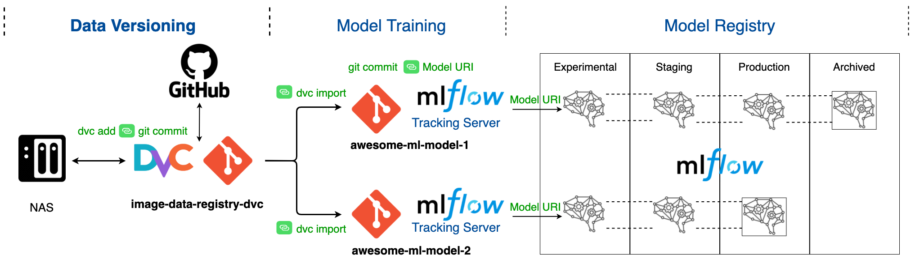

# Image Data Registry with DVC
This project contains an example of how to build a data registry for image datasets using DVC.

## Flow Diagram



## Project Infrastructure


Initialize the project with:
```bash
poetry install
```

First we need to initialize DVC with the following command:
```bash
poetry run dvc init
```

Then we need to configure the remote storage, is this case we will use local storage. However, is recommended to use
SSH, S3, GCS, etc. as a data store. 

```bash
poetry run dvc remote add -d storage /Users/marco/Documents/image_data_registry_dvc_storage
```

## Add a new raw dataset

```bash
poetry run dvc add raw/01_data_collection_16_oct_2021
```

Add the dataset to git 

```bash
git add raw/01_data_collection_16_oct_2021.dvc raw/.gitignore
```

Push the new dataset to the remote storage
```bash
poetry run dvc push
```

## Create a new image dataset from raw data

Import the raw image data into the input folder
```bash
poetry run dvc import https://github.com/marcopaspuel/image-data-registry-dvc \
                      raw/01_data_collection_16_oct_2021 \
                      -o processed/01_image_dataset/data/inputs
```

To track the changes with git, run: 
```bash
git add processed/01_image_dataset/data/inputs/01_data_collection_16_oct_2021.dvc \
        processed/01_image_dataset/data/inputs/.gitignore
```

## Create a DVC pipeline

Create and run the prepare stage 
```bash
poetry run dvc run -n remove_corrupted_images \
                   -d src/remove_corrupted_images.py -d data/inputs/01_data_collection_16_oct_2021 \
                   -o data/intermediate/remove_corrupted_images \
                   poetry run python src/remove_corrupted_images.py data/inputs/01_data_collection_16_oct_2021/
```

Track pipeline with git 
```bash
git add dvc.lock dvc.yaml
```

## How to add more raw data
First create a new branch
```bash
git checkout -b add-new-raw-data-collection
```

Then create a new directory in the raw data folder and add the new raw data

Add new raw data collection to dvc
```bash
poetry run dvc add raw/02_data_collection_20_oct_2021
```

Add the dataset to git and commit 
```bash
git add raw/02_data_collection_20_oct_2021.dvc raw/.gitignore
```

Push the new dataset to the remote storage
```bash
poetry run dvc push
```

Open a PR and merge 

## How to process the new raw data

First create a new branch 
```bash
git checkout -b add-new-raw-data-to-dataset
```

Import the new raw image data into the input folder
```bash
poetry run dvc import https://github.com/marcopaspuel/image-data-registry-dvc \
                      raw/02_data_collection_20_oct_2021 \
                      -o processed/01_image_dataset/data/inputs
```

To track the changes with git, run: 
```bash
git add processed/01_image_dataset/data/inputs/.gitignore processed/01_image_dataset/data/inputs/02_data_collection_20_oct_2021.dvc
```

Add new dataset to the list of dependencies if necessary

Rerun the pipeline
```bash
cd 01_image_dataset
poetry run dvc repro
```

Commit and push the results 
```bash
git push
poetry run dvc push
```

Open a PR and merge 